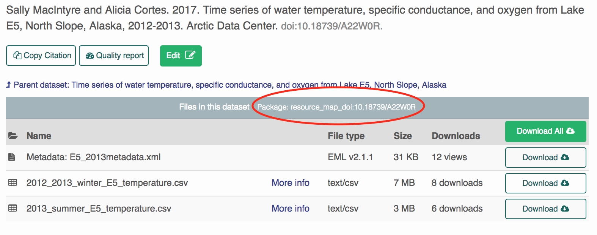

```{r setup, include = FALSE}
knitr::opts_chunk$set(
  collapse = TRUE,
  comment = "#>",
  eval = FALSE
)
```
*Mac Users:*
First install the following packages:    
```{r}
install.packages("devtools")
devtools::install_github("ropensci/EML")
devtools::install_github("NCEAS/datamgmt")
library(datamgmt)
library(dataone)
```

*PC Users:*
We currently have issues installing 'datamgmt' on PCs.  Instead of installing the package, we can load the functions directly into your global environment by copy-pasting.  
First install the following packages:    
```{r}
install.packages("devtools")
devtools::install_github("ropensci/EML")
devtools::install_github("NCEAS/arcticdatautils")
install.packages("dataone")
library(dataone)
```
Source (copy-paste into your R console) the file (https://github.com/dmullen17/work-samples/blob/master/R/wg_helpers.R)
*Note:* This concludes the differences between Mac and PC installs

Next, we need to specify which DataOne Member Node we want to interact with.  The following code specifies the Arctic Data Center.  Most of the functions that we use specificy the `mn` as the first argument.  First, we specify the coordinating node and then its corresponding member node.   
```{r}
cn <- CNode("PROD")
mn <- getMNode(cn, "urn:node:ARCTIC")
```


### Download a small Data Package
1. Click the "Download" or "Download all" buttons on the ADC User Interface.
  
<p align="center">

</p>
  
2. Download the attribute (column metadata) by pasting the url into this function.  This reads the attributes into a list of data.frames by default.  

- Optional Arguments:
- `write_to_csv` - writes each data.frame to a csv in the specified `download_directory`
- `prefix_file_names` - prepends the DOI identifier to each file
- `download_directory` - required if `write_to_csv = TRUE`
```{r}
attributes <- get_eml_attributes_url(mn,
                                     "https://arcticdata.io/catalog/#view/doi:10.18739/A22W0R",
                                     write_to_csv = TRUE,
                                     prefix_file_names = TRUE,
                                     download_directory = "/home/dmullen/downloads") 
```


### Download a Data Package without the UI
This is a better option (than the first method) if you would like to prefix your data files (in addition to metadata files) with the DOI identifier.  
<br>
All we need to specificy is the Package resource map. Copy-paste this into R. 
<br>
<p align="center">

</p>
<br>

- Optional Arguments:
- `prefix_file_names` - prepends the DOI identifier to each file.
- `download_column_metadata` - downloads column metadata to csv's.
- `convert_excel_to_csv` - attempts to convert excel workbooks in the package to csvs.  Not recommended if the csv's are already present in the package. 
- `download_child_packages` - downloads any "Nested" Data Packages associated with the Data Package.
```{r}
download_package(mn,
                 "resource_map_doi:10.18739/A22W0R",
                 download_directory = "/home/dmullen/downloads",
                 prefix_file_names = TRUE,
                 download_column_metadata = TRUE,
                 convert_excel_to_csv = FALSE,
                 download_child_packages = TRUE)
```


### Download multiple Data Packages
We can download multiple data packages by specifying multiple resource to the function `download_packages`.  Note the s!  
<br>
**Tip:** If you want to download Data Packages that are nested under a common Data Package, you can use the common "parent" resource map rather than copying pasting multiple resource maps into R.  
```{r}
download_packages(mn,
                  c("resource_map_doi:10.18739/A21G1P", "resource_map_doi:10.18739/A2RZ6X"),
                  "/home/dmullen/downloads",
                  prefix_file_names = TRUE,
                  download_column_metadata = TRUE)
```
